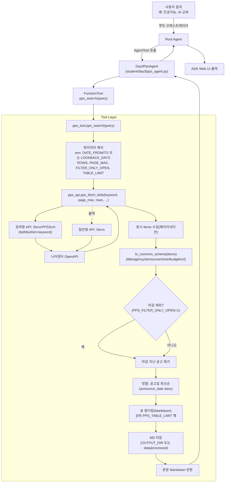

```mermaid
flowchart TD
    U["사용자 질의\n예: 인공지능, AI 교육"] -->|루트 오케스트레이터| RA["Root Agent"]
    RA -->|AgentTool 호출| PPSA["Day3PpsAgent\n(student/day3/pps_agent.py)"]

    PPSA --> FT["FunctionTool\npps_search(query)"]
    FT --> PT["pps_tool.pps_search(query)"]

    subgraph Tool Layer
        PT --> CFG["파라미터 해석\n.env: DATE_FROM/TO 또는 LOOKBACK_DAYS\nROWS, PAGE_MAX, FILTER_ONLY_OPEN, TABLE_LIMIT"]
        CFG --> API["pps_api.pps_fetch_bids(keyword, page_max, rows, ...)"]

        %% 🔽 엣지 라벨 대신 '검색형 우선'을 별도 노드로 분리
        API --> SRCH["검색형 API: ServcPPSSrch\n(bidNtceNm=keyword)"]
        SRCH --> GOV["나라장터 OpenAPI"]
        %% 검색형이 없을 때 일반형으로 폴백
        API -. 폴백 .-> GEN["일반형 API: Servc"]
        GEN --> GOV

        GOV --> API
        API --> RAW["원시 items 수집(페이지네이션)"]
        RAW --> NORM["to_common_schema(items)\n(title/agency/announce/close/budget/url)"]
        NORM --> FLT{"마감 제외?\n(PPS_FILTER_ONLY_OPEN=1)"}
        FLT -- 예 --> F1["마감 지난 공고 제거"]
        FLT -- 아니오 --> F1
        F1 --> SORT["정렬: 공고일 최신순\n(announce_date desc)"]
        SORT --> TBL["표 렌더링(Markdown)\n상위 PPS_TABLE_LIMIT 행"]
        TBL --> SAVE["MD 저장\n(OUTPUT_DIR 또는 data/processed)"]
        SAVE --> OUT["본문 Markdown 반환"]
    end

    OUT --> PPSA
    PPSA --> RA
    RA --> UI["ADK Web UI 출력"]
```