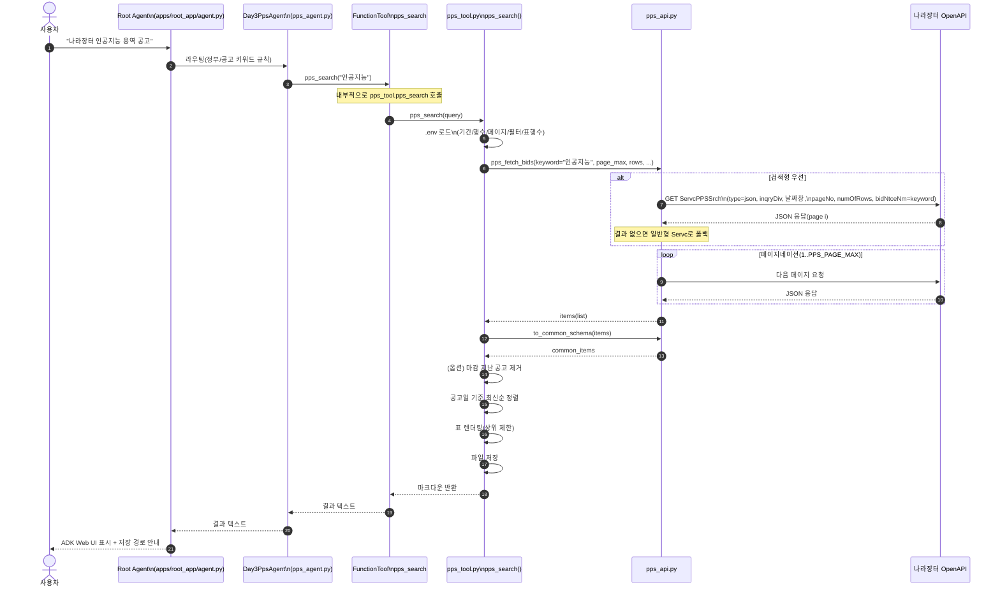

```mermaid
sequenceDiagram
    autonumber
    actor User as 사용자
    participant RA as Root Agent\n(apps/root_app/agent.py)
    participant PpsAgent as Day3PpsAgent\n(pps_agent.py)
    participant FTool as FunctionTool\npps_search
    participant PpsTool as pps_tool.py\npps_search()
    participant PpsApi as pps_api.py
    participant OpenAPI as 나라장터 OpenAPI

    User->>RA: "나라장터 인공지능 용역 공고"
    RA->>PpsAgent: 라우팅(정부/공고 키워드 규칙)
    PpsAgent->>FTool: pps_search("인공지능")

    Note over FTool: 내부적으로 pps_tool.pps_search 호출
    FTool->>PpsTool: pps_search(query)

    PpsTool->>PpsTool: .env 로드\n(기간/행수/페이지/필터/표행수)
    PpsTool->>PpsApi: pps_fetch_bids(keyword="인공지능", page_max, rows, ...)

    alt 검색형 우선
        PpsApi->>OpenAPI: GET ServcPPSSrch\n(type=json, inqryDiv, 날짜창,\npageNo, numOfRows, bidNtceNm=keyword)
        OpenAPI-->>PpsApi: JSON 응답(page i)
        Note over PpsApi: 결과 없으면 일반형 Servc로 폴백
    end

    loop 페이지네이션(1..PPS_PAGE_MAX)
        PpsApi->>OpenAPI: 다음 페이지 요청
        OpenAPI-->>PpsApi: JSON 응답
    end
    PpsApi-->>PpsTool: items(list)

    PpsTool->>PpsApi: to_common_schema(items)
    PpsApi-->>PpsTool: common_items

    PpsTool->>PpsTool: (옵션) 마감 지난 공고 제거
    PpsTool->>PpsTool: 공고일 기준 최신순 정렬
    PpsTool->>PpsTool: 표 렌더링(상위 제한)
    PpsTool->>PpsTool: 파일 저장
    PpsTool-->>FTool: 마크다운 반환
    FTool-->>PpsAgent: 결과 텍스트
    PpsAgent-->>RA: 결과 텍스트
    RA-->>User: ADK Web UI 표시 + 저장 경로 안내
```